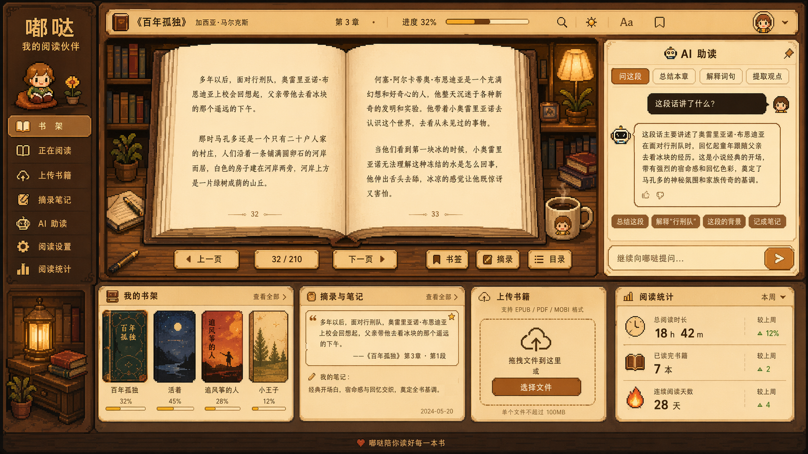

# 嘟哒 UI 设计规格书 v1

> 本文档是本项目 UI 改版期间的**单一真相源（SSOT）**。所有视觉/交互/文案/组件样式以此为准。
> 改版执行步骤请参见 [MIGRATION.md](./MIGRATION.md)。
> 开发总约束请参见 [CLAUDE.md](./CLAUDE.md)。

## 预览成品图



所有阶段实现必须对照这张图。如果实现和图不一致，以图为准。

---

# 1. 产品定位

## 1.1 产品名称
- 主品牌名：**嘟哒**
- 副标题：**我的阅读伙伴**

## 1.2 产品一句话定义

一个支持 EPUB / PDF / MOBI 上传、在线阅读、AI 陪读、摘录笔记和阅读统计的中文读书网站。

## 1.3 核心体验目标

用户打开网站后，应感受到自己进入了一个 **温暖、安静、像素风书房里的阅读空间**，而不是一个普通工具后台。

## 1.4 核心设计目标

新界面必须同时满足四点：
1. 有强识别度的像素风木质书房氛围
2. 中央阅读器清晰成为视觉中心
3. AI 助读自然融入阅读流程
4. 所有现有核心功能都能保留并重新组织

---

# 2. 设计总原则

## 2.1 视觉优先级

页面的视觉主次必须固定如下：

1. **第一优先级：中央书本阅读器**
2. 第二优先级：右侧 AI 助读面板
3. 第三优先级：左侧导航区
4. 第四优先级：底部功能概览卡片

任何装饰不得压过正文阅读区。

## 2.2 风格关键词（固定）

- warm wooden study room
- cream paper pages
- cozy pixel art
- retro game atmosphere
- Chinese reading product UI
- calm, warm, readable
- original, not direct imitation

## 2.3 使用原则

- 用户打开页面时，应该优先看到"继续阅读"
- 高价值操作必须离阅读器最近
- AI 是陪读助手，不是聊天软件主界面
- 摘录、书签、笔记必须从阅读行为自然触发
- 统计、上传、书架属于次级信息入口

## 2.4 不允许的方向

- 不允许把全站做成纯游戏 HUD
- 不允许正文使用像素字体
- 不允许侧栏比阅读器更抢眼
- 不允许 AI 面板做成客服聊天窗口风格
- 不允许靠大量随机装饰来堆氛围

---

# 3. 当前项目功能映射

## 3.1 当前应保留的功能

- 上传书籍（EPUB / PDF / MOBI）
- 文本解析
- 在线阅读
- 分页阅读
- 上一页 / 下一页
- 页码跳转
- 阅读主题切换
- AI 问答
- 摘录
- 笔记
- 阅读设置
- 阅读统计
- 本地或会话阅读状态

## 3.2 功能重新归位规则

所有功能必须重新归位到以下四个区域，不得再把大量功能零散堆在一个默认侧边栏控件区里：

1. 左侧导航区
2. 中央阅读器区
3. 右侧 AI 区
4. 底部概览卡片区

---

# 4. 全局页面结构

## 4.1 页面整体结构（桌面端四区布局）

```
┌──────────────────────────────────────────────────────────────────────────────┐
│ 顶部状态条                                                                   │
├───────────────┬───────────────────────────────────────┬──────────────────────┤
│ 左侧导航区     │ 中央阅读主区                            │ 右侧 AI 助读区        │
├───────────────┴───────────────────────────────────────┴──────────────────────┤
│ 底部功能概览区                                                               │
└──────────────────────────────────────────────────────────────────────────────┘
```

## 4.2 布局比例（桌面端固定）

| 区域 | 比例 |
|------|------|
| 左侧导航区 | 16% |
| 中央阅读主区 | 56% |
| 右侧 AI 助读区 | 28% |
| 底部功能概览区 | 约占页面总高 26% - 30% |

**阅读区内部比例：**
- 顶部状态条：8%
- 双页阅读器：72%
- 底部控制条：20%

**底部四卡比例：**
- 我的书架：30%
- 摘录与笔记：24%
- 上传书籍：22%
- 阅读统计：24%

## 4.3 响应式规则

视觉主次不能变（阅读器永远中心）。

**桌面端：** 三栏 + 底部四卡

**平板端：**
- 左侧导航可压缩为窄栏
- 右侧 AI 面板可变为抽屉或下方卡片区
- 阅读器仍居中

**移动端：**
- 单栏模式
- 阅读器优先
- AI 助读改成底部抽屉
- 导航改为顶部菜单或底部导航
- 双页阅读自动切换为单页阅读

---

# 5. 视觉系统规范

## 5.1 主色板

### 核心色

| 颜色 | 十六进制 | 用途 |
|------|---------|------|
| 深木棕 | `#3B2416` | 最外层背景、主边框 |
| 中木棕 | `#6B4024` | 中层框体、书桌 |
| 焦糖棕 | `#A86A33` | 主按钮、菜单 hover |
| 奶油纸 | `#F6E7C8` | 卡片/内容底板 |
| 浅纸白 | `#FFF6E8` | 书页纸张、最浅高光 |
| 金黄强调 | `#D7A441` | 进度条、高亮、徽章 |
| 深文字 | `#2E1D12` | 主要文字色 |

### 辅助色

| 颜色 | 十六进制 | 用途 |
|------|---------|------|
| 苔绿 | `#6E8B5B` | 成功状态、已读标记 |
| 柔红棕 | `#B96A4A` | 强调按钮、shadow |
| 暖灯黄 | `#F2C66D` | 台灯光、高亮点缀 |
| 次级灰棕 | `#8E735B` | 次级文字、分隔线 |

## 5.2 材质语言（分层明确）

**最外层背景：** 深木色 / 暖棕色书房背景

**中层结构框：**
- 木头边框
- 像素风描边
- 局部有桌面、书柜、台灯、书堆

**内容底板：**
- 奶油纸色
- 轻旧纸张感
- 不能过花，不能影响阅读

## 5.3 阴影规则

- 阴影应为复古像素感或轻木质阴影
- **不使用** 现代玻璃拟态
- **不使用** 强透明模糊
- **不使用** 大面积霓虹发光

## 5.4 边框规则

- 主边框：深棕 2px 到 3px
- 次级边框：浅棕 1px 到 2px
- 局部按钮允许像素方角
- 卡片统一边角，不要每块都不同

---

# 6. 字体系统规范

## 6.1 字体角色划分

三种角色必须严格分开：

### A. 品牌标题字体

**用途：**
- Logo "嘟哒"
- 特殊装饰标题
- 少量 badge / 章标题装饰

**要求：**
- 像素字体或高识别复古字体
- 只少量使用

### B. 导航与功能字体

**用途：**
- 左侧菜单
- 顶部工具栏
- 标签、按钮、数字、状态

**要求：**
- 清晰、规整
- 可以带轻像素感
- 不可影响识别

### C. 正文阅读字体

**用途：**
- 书页正文
- 摘录正文
- AI 长回答正文

**要求：**
- **必须是可长时间阅读的中文字体**
- 推荐宋体感中文阅读字体或稳定中文正文字体
- **禁止正文像素化**

## 6.2 字号建议（桌面端默认）

| 位置 | 字号范围 |
|------|---------|
| 品牌 Logo | 40 - 56 |
| 副标题 | 16 - 20 |
| 左侧菜单 | 18 - 22 |
| 顶部状态条 | 16 - 18 |
| 正文阅读 | 28 - 34 |
| AI 卡片正文 | 18 - 22 |
| 底部卡片标题 | 22 - 26 |
| 卡片说明文字 | 14 - 18 |

移动端按比例下调。

---

# 7. 图标系统规范

## 7.1 图标风格

- 全站图标必须**统一为像素风**
- 图标线条要粗一点
- 小尺寸下必须可辨认
- 颜色以深棕、焦糖棕、金黄、苔绿为主

## 7.2 应用范围

**允许使用像素图标的位置：**
- 左侧导航菜单
- 顶部工具按钮
- AI 助读标题
- 底部统计卡片
- 上传卡片
- 书签 / 摘录 / 目录按钮

**不建议** 在正文区大面积插图化。

---

# 8. 页面级结构说明

## 8.1 阅读主控台页（核心页面，必须优先重做）

### 8.1.1 页面组成
- 顶部状态条
- 左侧导航区
- 中央阅读区
- 右侧 AI 助读区
- 底部功能概览区

### 8.1.2 页面功能目标

用户打开后应能立即完成：
- 继续阅读当前书
- 翻页
- 保存书签
- 做摘录
- 问 AI
- 看近期书架和统计

## 8.2 书架页

**功能目标：** 展示全部书籍和阅读状态。

**内容模块：**
- 顶部标题：我的书架
- 搜索框
- 分类筛选：全部 / 正在读 / 已读 / 未开始
- 书籍卡片网格
- 最近阅读排序
- 继续阅读按钮

**视觉要求：**
- 每本书必须有封面缩略图
- 显示书名、作者、进度、最后阅读时间
- 风格延续木质书房像素体系

## 8.3 摘录与笔记页

**功能目标：** 沉淀读书记录。

**内容模块：**
- 顶部标题：摘录与笔记
- 筛选栏：按书籍 / 按日期 / 按类型
- 摘录列表
- 笔记列表
- 跳回原文按钮
- 编辑按钮

**视觉要求：**
- 摘录像便签或手帐卡
- 笔记像纸条或小纸页
- 不要像后台表格

## 8.4 阅读统计页

**功能目标：** 展示读书习惯和累计成果。

**内容模块：**
- 总阅读时长
- 已读书籍数
- 连续阅读天数
- 周/月变化
- 目标完成度
- 趋势图

**视觉要求：**
- 数据卡片为复古信息看板风
- 图表要清晰简洁
- 可用像素小图标点缀，不要复杂动画

## 8.5 阅读设置页

**功能目标：** 统一管理阅读体验参数。

**内容模块：**
- 主题切换
- 字号
- 行距
- 页宽
- 单页 / 双页模式
- 昼夜模式
- AI 面板显示方式

**视觉要求：**
- 做成设置面板，不要散落进默认侧栏各处
- 各项控件统一风格

---

# 9. 模块级详细规格

## 模块 A：左侧固定导航区

### A.1 结构（从上到下三段）

**第一段：品牌区**
- Logo "嘟哒"
- 副标题 "我的阅读伙伴"
- 一个像素角色头像（像素风角色或坐着看书的小头像）
- 一个小花盆或书本摆件

**第二段：功能导航区（菜单顺序固定）**
1. 书架
2. 正在阅读
3. 上传书籍
4. 摘录笔记
5. AI 助读
6. 阅读设置
7. 阅读统计

**第三段：氛围装饰区**
- 台灯
- 小书堆
- 盆栽
- 小桌子或书柜
- **仅作装饰，不承担主功能**

### A.2 交互

- 当前菜单项高亮
- hover 时按钮轻微发亮或上浮
- 点击后切换主页面内容
- 按钮为像素风矩形按钮，**但不要过厚重**

### A.3 视觉要求

- 深木棕背景
- 像素风边框
- 菜单按钮为焦糖棕或浅木色
- 高亮项明显但不过分刺眼

## 模块 B：顶部状态条

### B.1 结构（从左到右固定）

1. 当前书籍小 icon
2. 书名
3. 作者
4. 当前章节
5. 阅读进度条和百分比
6. 搜索
7. 阅读主题
8. 字号
9. 书签
10. 用户头像

### B.2 功能

- 书名点击可打开目录或书籍信息
- 进度条可展示当前位置
- 搜索可查词或查段落
- 主题和字号直接调节阅读器
- 书签保存当前页

### B.3 视觉要求

- 作为横向木质工具条
- 高度较窄
- 图标像素化
- 排版规整
- **不应像浏览器导航栏**

## 模块 C：中央阅读主区

### C.1 结构（三层）

**第一层：阅读器外框**
- 木质大框
- 书本被放置在桌面或书架前
- 两侧可有书柜、灯、植物作氛围补充

**第二层：双页书本阅读器**
- 展开的书本居中
- 左页正文
- 右页正文
- 中间书脊明显
- 页底有页码

**第三层：阅读控制条**
- 上一页
- 当前页 / 总页数
- 下一页
- 书签
- 摘录
- 目录

### C.2 功能要求

- 分页显示内容
- 上一页 / 下一页
- 当前页码显示
- 页码跳转
- 保存书签
- 对当前选段摘录
- 章节目录跳转
- 支持主题切换
- 支持单页模式与双页模式

### C.3 内容要求

- 正文区域内不得出现多余装饰
- 文字必须可长时间阅读
- 行高宽松
- 页边距大于普通网页文章布局
- 页码保持克制

### C.4 文字样式要求（重点）

- 正文用**清晰中文阅读字体**
- 行高舒适
- 字体偏宋体或阅读型字体
- 页码小而克制
- 段间距统一
- **不做强烈渐变或花哨效果**

### C.5 视觉要求

- 中间书本必须占据最大视觉面积
- 纸张颜色明显亮于外层木质框
- 阅读器必须是**全页面焦点**

## 模块 D：右侧 AI 助读区

### D.1 结构（五段）

**第一段：标题区**
- 标题："AI 助读"
- 小机器人像素 icon
- 小图钉或装饰件

**第二段：功能 tab（固定四个）**
1. 问这段
2. 总结本章
3. 解释词句
4. 提取观点

**第三段：问答展示区**
- 显示提问和回答
- 回答以卡片形式展示
- 一条回答可支持多个快捷操作

**第四段：快捷操作区（操作项建议固定四个）**
1. 总结这段
2. 解释背景
3. 记成笔记
4. 继续追问

**第五段：底部输入区**
- 文本输入框
- 发送按钮
- placeholder："继续向嘟哒提问…"

### D.2 功能要求

- 默认基于当前页上下文提问
- 支持基于当前章节总结
- 支持词句解释
- 支持观点提取
- 支持将回答保存为笔记
- 一键保存为笔记

### D.3 视觉要求

- 面板独立清晰
- 纸板 / 奶油卡片式
- **不像即时聊天 app**
- 更像**阅读辅助工具箱**
- 比阅读器更像"功能卡片区"

## 模块 E：底部功能概览区（固定四张卡片）

### E.1 我的书架卡片

**内容：**
- 4 本最近书籍封面
- 各自进度条
- 书名
- 查看全部入口

**功能：**
- 点击封面进入该书
- 点击查看全部进入书架页

**视觉：**
- 像木架上的小书封陈列
- 卡片内层为奶油底
- 书封缩略图整齐排列
- 底部进度条
- 边框木质描边

### E.2 摘录与笔记卡片

**内容：**
- 最近摘录一句
- 所属书名 / 章节 / 页码
- 最近笔记摘要
- 日期

**功能：**
- 查看全部摘录
- 跳回原文位置
- 进入笔记页

**视觉：**
- 便签 / 手帐页风格
- 可以带引号、小星标、小别针

### E.3 上传书籍卡片

**内容：**
- 支持格式：EPUB / PDF / MOBI
- 拖拽区域
- 选择文件按钮
- 文件大小提示

**功能：**
- 上传新书
- 上传后入书架

**视觉：**
- 像独立工具卡
- 中间有大像素上传 icon
- CTA 按钮醒目，但不抢主视觉

### E.4 阅读统计卡片

**内容：**
- 总阅读时长
- 已读书籍数
- 连续阅读天数
- 较上周变化

**功能：**
- 点击进入完整统计页

**视觉：**
- 小型数据看板
- 像素时钟、书本、火焰、趋势 icon
- 复古信息看板风

---

# 10. 组件规格

## 10.1 按钮（三类）

### 主按钮

**用途：** 选择文件 / 下一页 / 发送 AI 问题 / 继续阅读

**样式：**
- 焦糖棕底（`#A86A33`）
- 深棕边框
- 奶油色文字
- 轻像素方角
- hover 略亮

### 次按钮

**用途：** 书签 / 摘录 / 目录 / 筛选操作

**样式：**
- 奶油底（`#F6E7C8`）
- 深棕描边
- hover 变浅焦糖

### 标签按钮 / tab

**用途：** AI tab / 筛选器 / 小操作 chips

**样式：**
- 更扁平
- 更小
- 边框清晰
- 当前项高亮

## 10.2 卡片（全站统一）

- 木框或深棕描边
- 奶油色内容底板（`#F6E7C8`）
- 顶部有标题
- 角标或小装饰可选
- 内边距统一

## 10.3 输入框

- 奶油底（`#F6E7C8`）
- 深棕描边
- 文本清晰
- placeholder 用浅灰棕（`#8E735B`）
- **不要圆润现代聊天气泡风**

## 10.4 进度条

- 细长横条
- 背景浅木色
- 前景金黄（`#D7A441`）或焦糖色
- 允许轻像素块状感

---

# 11. 页面状态规范

## 11.1 默认状态（有当前书在读）

- 中央显示阅读器
- 右侧 AI 面板可用
- 底部显示数据概览

## 11.2 空状态

### 无书籍时

中央阅读区不显示双页正文，改为欢迎上传态：
- 书房背景保留
- 中央出现一本合上的空书或上传提示
- 文案：**"上传一本书，开始与你的阅读伙伴一起读书"**

### 无摘录时

摘录卡片显示：
- **"暂无摘录"**
- **"去阅读并保存第一条摘录"**

### 无统计时

统计卡片显示：
- **"还没有阅读记录"**
- **"开始阅读后这里会记录你的进步"**

## 11.3 加载状态

- 解析中：显示复古像素 loading 状态
- AI 回答中：显示轻量加载反馈
- **不要** 现代 spinner 过强抢眼

---

# 12. 文案规范

## 12.1 品牌文案

- 主标题：**嘟哒**
- 副标题：**我的阅读伙伴**

## 12.2 AI 输入区文案

placeholder 固定：**"继续向嘟哒提问…"**

## 12.3 上传区文案

- **"拖拽文件到这里"**
- **"或"**
- **"选择文件"**
- **"支持 EPUB / PDF / MOBI 格式"**

## 12.4 统计区文案

- **"总阅读时长"**
- **"已读书籍"**
- **"连续阅读天数"**
- **"较上周"**

## 12.5 其他

- 底部 footer：**"嘟哒陪你读好每一本书"**（预览图中有）

---

# 13. 交互流规范

## 13.1 主路径

用户最常见流程：

1. 打开网站
2. 自动回到"正在阅读"
3. 查看当前页内容
4. 翻页
5. 遇到问题点击"问这段"
6. 保存书签或摘录
7. 看底部数据与笔记概览
8. 关闭，下次继续

## 13.2 上传新书流程

1. 点击"上传书籍"
2. 选择 EPUB / PDF / MOBI
3. 解析中
4. 成功后加入书架
5. 可立即进入阅读

## 13.3 摘录流程

1. 用户在当前阅读页选中内容或触发摘录
2. 保存摘录
3. 底部摘录卡片刷新
4. 可跳到摘录与笔记页查看

## 13.4 AI 助读流程

1. 用户切换到 AI 助读区
2. 选择：问这段 / 总结本章 / 解释词句 / 提取观点
3. 得到卡片式回答
4. 可继续追问或保存为笔记

## 13.5 快捷操作（必须在界面中一眼能找到）

- 上传一本新书
- 继续阅读
- 问这段
- 总结本章
- 保存摘录
- 添加书签

---

# 14. 可访问性与阅读体验规范

## 14.1 必须保证

- 正文与背景对比充足
- 阅读字体不能过小
- 行高足够
- 页边距足够
- 按钮可点击区域够大
- 移动端阅读不拥挤

## 14.2 reduced motion

- 动效尽量轻
- 不要连续闪烁
- 允许关闭或最小化动效

---

# 15. Streamlit 实施限制说明

## 15.1 必须遵守

目标是**在现有 Streamlit 项目上最大程度还原此设计**。

## 15.2 不允许

- 不允许先重构为 React 再开始改样式
- 不允许推翻现有阅读逻辑
- 不允许为了样式直接删除现有核心功能
- 不允许把页面改成只好看但不能读

## 15.3 优先级（Codex 改造顺序）

1. **第一步**：重构页面布局骨架
2. **第二步**：重做中央阅读器
3. **第三步**：重做右侧 AI 助读区
4. **第四步**：补齐底部四卡结构
5. **第五步**：统一视觉系统
6. **第六步**：适配移动端和空状态

> 本项目具体阶段拆分为 10 步（阶段 0-9），见 [MIGRATION.md 第 7 节](./MIGRATION.md#7-阶段分解对照)。

---

# 附录 A：预览图分析（对照图）

预览图 `docs/design-preview.png` 关键细节清单（按区域）：

## 左侧导航（深木棕立柜）
- 顶部：品牌区（"嘟哒" Press-Start-2P 风字体 + "我的阅读伙伴" 副标 + 看书角色头像 + 黄花盆）
- 菜单 7 项，高亮态为焦糖棕底填充（预览图中"书架"是高亮态）
- 菜单 icons（书形/圆形/上传云/铅笔纸/机器人/齿轮/柱状图）
- 底部：像素台灯 + 书堆 + 盆栽（角落装饰）

## 顶部状态条（浅木色横条）
- 最左：书本 icon
- 书名：《百年孤独》（加书名号）
- 作者：加西亚·马尔克斯（浅灰棕文字）
- 章节：第 3 章
- 进度：32% + 细长进度条（金黄色填充，本色背景）
- 搜索 icon（放大镜）
- 主题 icon（☀ 太阳）
- 字号 icon（Aa）
- 书签 icon（书签形状）
- 用户头像（像素人物 + 下拉小箭头）

## 中央阅读器（预览图视觉中心）
- 木质大框 + 两侧书柜（左右都是像素书脊）
- 双页书本：奶油纸色（#FFF6E8），页码 32 / 33
- 左页 3 段文字，右页 3 段文字（示例：《百年孤独》开场文字）
- 书脊中分明显
- 书下方两侧：左边有笔记本+铅笔，右边有咖啡杯（杯子上有看书角色头像）
- 控制条：6 个按钮（上一页 / 32 / 210 / 下一页 / 书签 / 摘录 / 目录）带像素箭头装饰

## 右侧 AI 助读（奶油色面板）
- 标题："AI 助读" + 机器人 icon + 右上角小红图钉
- 4 tab：问这段（高亮态）/ 总结本章 / 解释词句 / 提取观点
- 用户问：深棕气泡"这段话讲了什么？" + 右侧角色头像
- AI 回答：机器人头像 + 奶油色卡片正文
- 卡片底部：👍 👎（反馈）
- 快捷操作 4 按钮：总结这段 / 解释"行刑队" / 这段的背景 / 记成笔记
- 底部输入框："继续向嘟哒提问…" + 焦糖棕圆角发送按钮（▶）

## 底部四卡（高度约占页面 26-30%）

### 卡 1：我的书架（宽 30%）
- 标题 + "查看全部 >"
- 4 本封面（《百年孤独》绿色封 / 《活着》蓝色月夜 / 《追风筝的人》橙色 / 《小王子》森林）
- 每本下方显示书名 + 百分比 + 金黄进度条

### 卡 2：摘录与笔记（宽 24%）
- 标题 + "查看全部 >"
- 引号符 + 一段摘录文字（《百年孤独》开场）
- 归属：——《百年孤独》第 3 章·第 1 段 + 小星标
- 笔记 icon + "我的笔记：" + 笔记内容
- 日期：2024-05-20（右下角）

### 卡 3：上传书籍（宽 22%）
- 标题 + 云 icon
- "支持 EPUB / PDF / MOBI 格式"（小字）
- 大像素上传云 icon（虚线框）
- "拖拽文件到这里 / 或"
- 焦糖棕主按钮"选择文件"
- 小字提示"单个文件不超过 100MB"

### 卡 4：阅读统计（宽 24%）
- 标题 + "本周 ▼"
- 3 行数据：
  - 🕐 总阅读时长：18 h 42 m | 较上周 ▲12%
  - 📖 已读完书籍：7 本 | 较上周 ▲ 2
  - 🔥 连续阅读天数：28 天 | 较上周 ▲ 4
- delta 用苔绿色向上三角表示正向

## 页面底部
- 居中 footer：红心 + **"嘟哒陪你读好每一本书"**

---

# 附录 B：与 MIGRATION.md 分工

| 文档 | 职责 |
|------|------|
| **DESIGN_SPEC.md**（本文件）| 设计终态：长什么样、有什么内容、交互规则。SSOT。|
| **MIGRATION.md** | 从当前代码迁移到此设计的**路径**：旧功能→新位置映射、技术决策、阶段拆分、范围边界 |
| **CLAUDE.md** | 项目通用开发约束（与 UI 无关）|
| **TODO.md** | 本次改版之外的 backlog |

三份文档各司其职，不重复。
